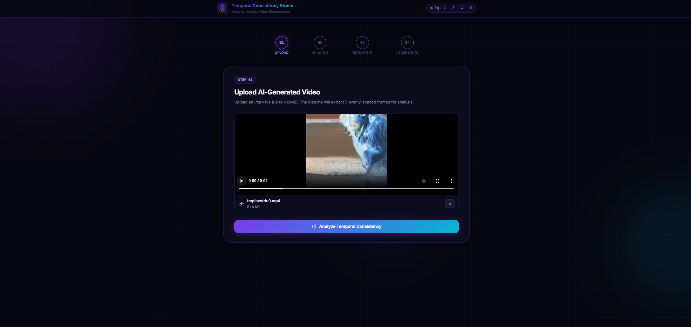
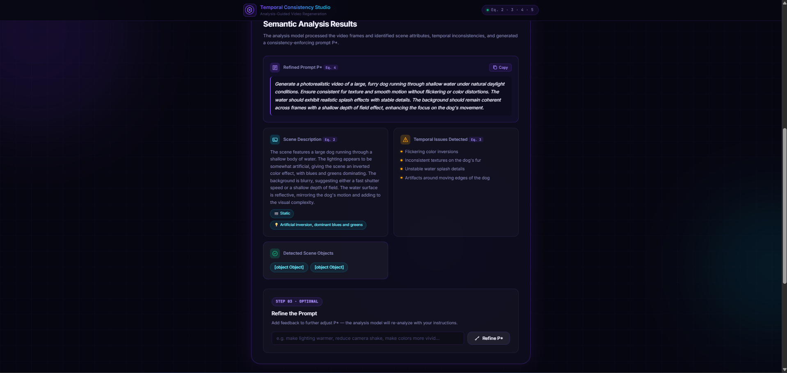
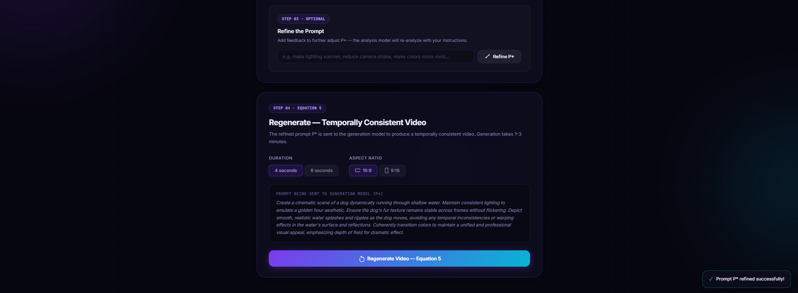

# Enforcing Temporal Consistency in AI-Generated Videos through Analysis-Guided Regeneration

---

## Overview

Text-to-video diffusion models (AnimateDiff, ModelScope, VideoCrafter2) generate visually appealing video but suffer from temporal artifacts — flickering textures, unstable motion, and inconsistent color transitions across frames. This project implements a **retraining-free post-processing pipeline** that enforces temporal consistency on any AI-generated video without modifying the underlying generation model.

---

## How It Works

The pipeline operates as an outer enhancement layer on top of a frozen base generator. No parameters of the generator are modified at any point.

### Pipeline Stages

**Stage 1 — Frame Decomposition**

The input video V is split into individual frames:

```
V = {f₁, f₂, ..., fₙ}
```

Frames are normalized on color space and resolution.

**Stage 2 — Semantic Embedding (Eq. 2)**

Each frame is passed through a pretrained vision-language encoder (CLIP ViT-B/32) to extract semantic features:

```
sᵢ = Φ(fᵢ)
```

A global semantic representation is obtained by averaging frame-level embeddings:

```
S = (1/n) Σᵢ sᵢ
```

This captures consistent object identities, scene context, and appearance attributes across time.

**Stage 3 — Prompt Refinement (Eq. 4)**

Technical attributes T (camera motion type, lighting cues, temporal pacing) are extracted alongside S. A refined structured prompt is generated:

```
P* = Ψ(S, T)
```

P* encodes stabilized scene attributes — consistent lighting, object continuity — and serves as the conditioning signal for regeneration.

**Stage 4 — Video Regeneration (Eq. 5)**

P* is sent to the original frozen generator G in Video-to-Video conditioned mode, using original frames as spatial anchors:

```
V' = G(P*)
```

The base generator used in experiments is ModelScope. No retraining or parameter modification is performed on G.

**Stage 5 — Temporal Alignment (Eq. 6)**

Residual inter-frame irregularities are removed using optical flow-based frame alignment (RAFT):

```
Lₜ = Σᵢ ‖v'ᵢ₊₁ − warp(v'ᵢ, mᵢ)‖²
```

This penalizes inter-frame disturbances and suppresses flickering artifacts.

**Stage 6 — Iterative Frame Correction (Eq. 7)**

The total objective balances temporal stability with spatial fidelity:

```
L = Lₜ + λ · L_spatial
```

Hyperparameters validated on held-out set: λ = 0.6, α = 0.4, β = 0.3.

---

## Algorithm

```
Input:  AI-generated video V = {f₁, f₂, ..., fₙ}
Output: Temporally consistent video V'

1.  Decompose V into individual frames {f₁, ..., fₙ}
2.  For each frame fᵢ:
      a. Extract semantic embedding sᵢ = Φ(fᵢ)  [CLIP]
      b. Extract motion features mᵢ from (fᵢ, fᵢ₊₁)
3.  Aggregate global representation: S = (1/n) Σ sᵢ
4.  Estimate inter-frame motion properties and technical attributes T
5.  Generate refined prompt: P* = Ψ(S, T)
6.  Regenerate video with frozen model: V' = G(P*)  [ModelScope]
7.  For each consecutive frame pair (v'ᵢ, v'ᵢ₊₁) in V':
8.  Apply iterative frame correction to remove residual flicker
9.  Minimize total objective: L = Lₜ + λ · L_spatial
10. Return V'
```

---

## Models Used

| Component | Model | Role |
|---|---|---|
| Semantic encoder Φ | CLIP (ViT-B/32) | Frame-level semantic embedding |
| Optical flow | RAFT | Motion estimation between frames |
| Base generator G | ModelScope | Frozen video regeneration |
| Test set source | Stable Video Diffusion v2 | Generated the 200-clip evaluation set |

---

## Evaluation

Tested on 200 video clips generated by Stable Video Diffusion v2 using UCF-101 action category prompts. Each clip: 64 frames, 512×512 resolution.


### Results

The proposed framework showed consistent improvement 
- **Blind Video Consistency (BVC)** — optical flow-based alignment and smoothing
- **Rolling Guidance Refinement** — iterative consistency correction


---

## Comparison with Existing Methods

| Method | Category | Retraining | Limitation |
|---|---|---|---|
| Video Diffusion with Temporal Attention | Model-level | Yes | High training cost, model-specific |
| Space-Time Transformer Generators | Model-level | Yes | Requires large-scale datasets |
| Motion-Guided Diffusion | Model-level | Yes | Error propagation in complex scenes |
| Blind Video Consistency (BVC) | Post-processing | No | Struggles with large motion changes |
| Deep Video Prior (DVP) | Post-processing | No | Computationally expensive |
| Rolling Guidance Refinement | Post-processing | No | Slow for long videos |
| **Proposed Framework** | **Post-generation** | **No** | Depends on base generator quality |

---

## Key Properties

- **Model-agnostic** — works with any frozen video generation architecture
- **Retraining-free** — no parameter updates to the base generator
- **Three contributions:**
  1. Semantic-guided prompt refinement pipeline (aggregates scene-level features to reduce regeneration ambiguity)
  2. Motion-semantically aware temporal alignment (inhibits inter-frame difference)
  3. Iterative frame correction cycle (eliminates residual flicker while preserving spatial faithfulness)

---

## Dependencies

```bash
pip install torch torchvision opencv-python transformers diffusers
```

| Package | Purpose |
|---|---|
| `torch`, `torchvision` | Core deep learning |
| `opencv-python` | Frame extraction and processing |
| `transformers` | CLIP semantic encoder |
| `diffusers` | ModelScope video generation |

---

## UI Walkthrough

### Step 1: Upload Video


### Step 2: Semantic Analysis


### Step 3: Prompt Refinement & Regeneration


### Step 4: Temporally Consistent Video


---
